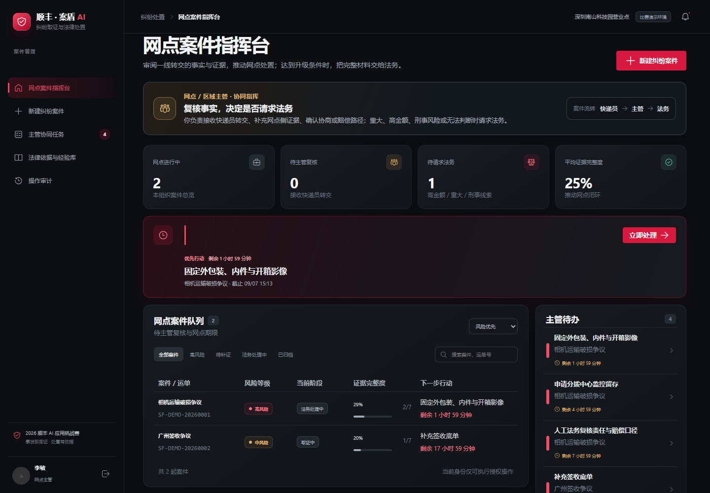

# 顺丰快递纠纷智能取证与法律处置系统

这是“2026 顺丰 AI 应用挑战赛”的可运行 MVP。系统围绕“事发即固证”打通登录、角色权限、建案、AI 分类与澄清、证据保全、责任风险辅助研判、处置 SOP、文书草稿、期限提醒、法务升级和案件归档。

## 本地启动

环境要求：Node.js 22+（推荐当前 Node.js 25，使用内置 SQLite）和 pnpm。

```bash
pnpm install
pnpm dev
```

浏览器打开 <http://localhost:5173>。`pnpm dev` 会同时启动 Vite 前端和 `http://127.0.0.1:3001` API。生产模式可以先构建，再由 API 服务提供静态页面：

```bash
pnpm build
pnpm start
```

需要启用阿里云百炼兼容模型时，复制 `.env.example` 为 `.env`，填写 `AI_BASE_URL`、`AI_API_KEY` 和文本模型名（例如 `qwen-plus`）。`.env` 已被 Git 忽略；没有密钥时系统自动使用本地规则与知识检索。Node 24+ 启动脚本会读取系统代理，便于企业网络访问模型服务。

仓库的 GitHub Actions 会在推送 `main` 后发布 GitHub Pages。Pages 构建使用演示数据和规则辅助模式，适合展示工作台、固证清单、风险研判和知识库；完整 SQLite、文件上传、角色授权和审计能力请使用上面的本地启动方式。

在线预览：<https://ment5981.github.io/an-dun-ai-demo/>。GitHub Pages 预览图：



默认数据目录是项目下的 `data/`，包含 SQLite 数据库和私有原始证据目录。可用 `DATA_DIR` 指向其他本地目录；`PORT`、`HOST`、`ALLOWED_ORIGINS` 和 `DEMO_PASSWORD` 可用于部署配置。不要把 `data/` 暴露为静态目录。

## 演示账号

三个账号密码均为 `Sf2026!demo`：

| 账号 | 身份 | 数据范围 |
|---|---|---|
| `courier` | 快递员 | 本人案件；建案、固证、澄清、协商，无法处理时转交主管 |
| `supervisor` | 网点 / 区域主管 | 本组织案件；接收快递员、复核、协商 / 赔偿，必要时请求法务 |
| `legal` | 法务 | 全部案件；接收、退回补证、人工审核、文书与重大案件归档 |

登录时选择的身份必须和账号真实角色一致。服务器会话使用 HttpOnly Cookie，前端隐藏按钮不构成权限边界。

## 推荐演示路径

1. 以 `courier` 登录，建案、先上传原始证据，再在“处置 SOP”选择“转交主管审核”。
2. 切换 `supervisor`，在网点案件指挥台接收交接；普通案件继续补证 / 协商，无法判断或触发高金额、重大、刑事条件时选择“申请法务接收”。
3. 切换 `legal`，在法务接收与复核台接收案件；可以退回主管补证，或完成法务审核并把处置意见回传主管。
4. 在“AI 固证清单”上传真实的图片、视频、聊天记录、运单或文本原件。系统保存原始文件、上传人、时间和 SHA-256 指纹，上传类别才会计入完整度。
5. 在“案情与责任研判”补充澄清问题，查看争议焦点、责任风险和可追溯引用。
6. 在“法律依据与经验库”提交个人历史案例或附件；案例先进入“待法务审核”，通过后才参与 AI 检索，不会自动变成法律结论。
7. 在“法律文书”生成情况说明、证据目录、监控调取函或法务答辩材料草稿，核对后下载并归档。

## AI 核心链路与知识库边界

每次案件研判都会经过五个可解释阶段：案件分类、RAG 知识检索、证据缺口识别、责任风险辅助研判、处置建议生成。案件详情中的 AI 处理卡会展示每一步的状态、依据来源、匹配知识、已具备和缺失证据、人工复核原因以及下一步行动。服务端把完整 `aiTrace` 保存到 `AIAnalysis.result`，重跑分析后仍可追溯本次使用的知识版本和模型状态。没有配置模型密钥时，系统使用服务端规则和本地中文检索，界面显示“规则辅助模式”；配置兼容 OpenAI Chat Completions 的服务地址、`AI_API_KEY` 和 `AI_MODEL` 后，模型只会基于检索到的候选来源辅助整理摘要、焦点和问题，并记录调用状态与耗时。

风险升级、证据要求、引用白名单和法务锁仍由服务端约束。模型只能从服务端候选 ID 中选择，不能创造法条、案号、胜诉率或新事实；来源为空、调用失败或输出未通过校验时自动回退到规则 + RAG，并在分析结果中写明原因。当前 MVP 不做 OCR 或视频内容识别，上传原件后需要人工核验内容。

知识库条目包含类型、版本、来源 URL、核验日期、创建人和审核状态。快递员与主管可提交自己的历史经验和原始附件，法务审核通过后才进入检索索引；法律法规引用来自官方来源；演示 SOP、模拟历史案例和模板会清楚标记为非正式材料。系统不会生成虚构法条、案号或胜诉率，所有 AI 输出均标明“辅助研判，法务最终决策”。来源说明见 [`docs/LEGAL_SOURCES.md`](docs/LEGAL_SOURCES.md)。

## 验证命令

```bash
pnpm build
pnpm test:api
# 另开一个终端运行 pnpm dev 后，可执行浏览器视觉验收
pnpm test:visual
```

`test:api` 会在临时目录启动隔离 API，验证 18 项权限、持久化、证据指纹、文书和升级归档闭环，不改动项目 `data/`。接口、Schema、页面结构和开发 Tasks 见 [`docs/ARCHITECTURE.md`](docs/ARCHITECTURE.md)。

## 重要 MVP 约束

这是面向比赛演示的本地系统。金额阈值、期限提醒和内置演示案件属于可配置的示例策略；举证期限、设备保管期限、保险条款和赔偿结论必须由授权人员结合真实通知与材料核验。系统用于辅助固定证据和组织处置，不替代法务意见或司法判断。
